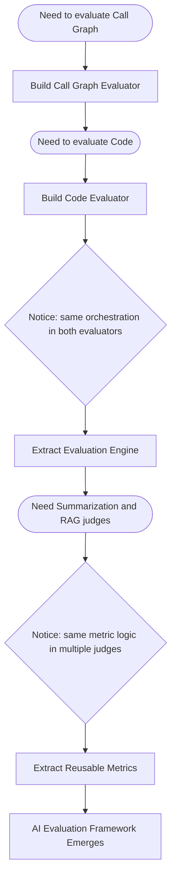
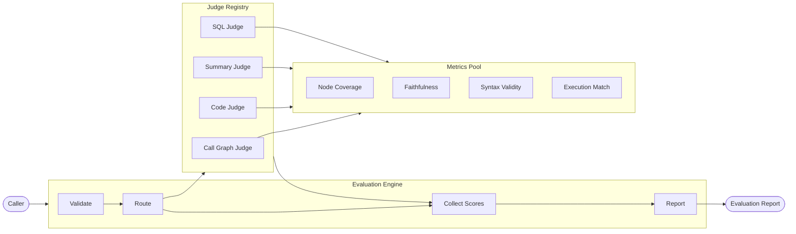
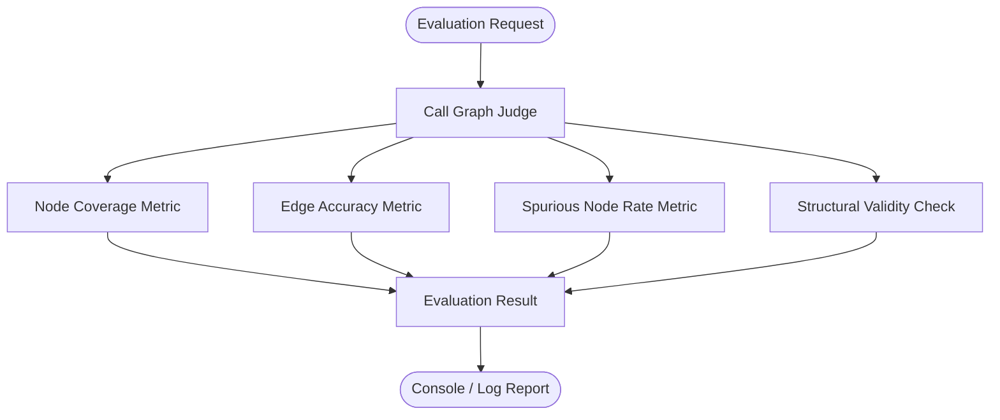
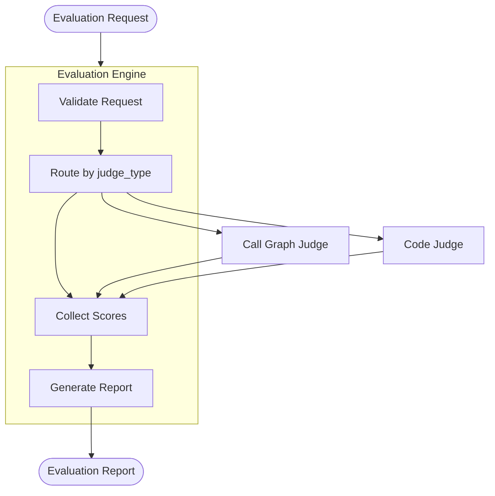
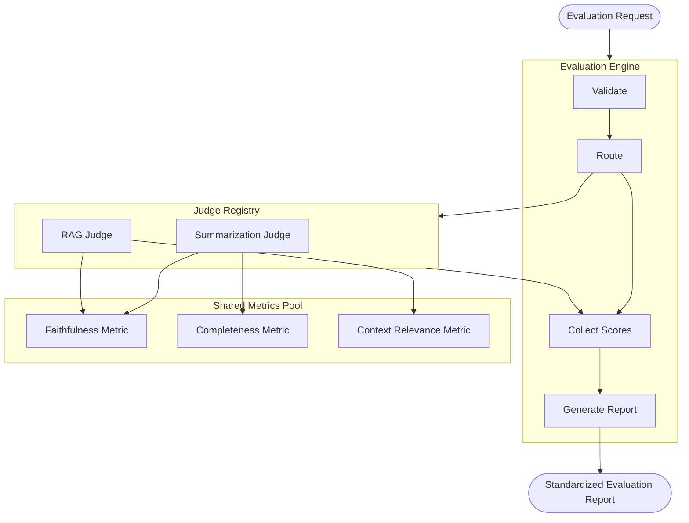
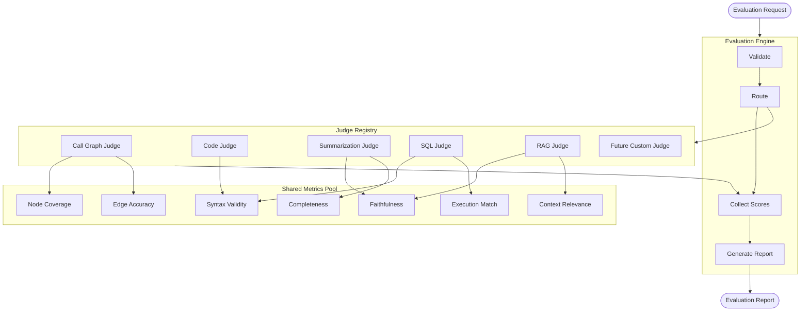
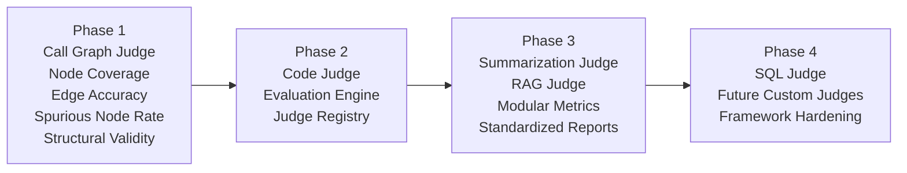
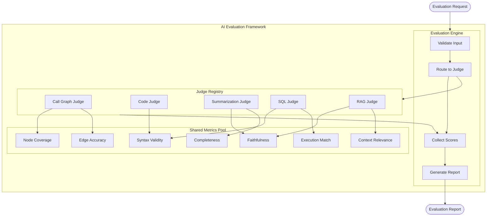

# AI Evaluation Framework
## Technical Design Note

---

## Table of Contents

1. [Understanding AI Evaluation](#1-understanding-ai-evaluation)
2. [Evolution of an AI Evaluation Framework](#2-evolution-of-an-ai-evaluation-framework)
3. [How Modern AI Evaluation Frameworks Work](#3-how-modern-ai-evaluation-frameworks-work)
4. [Evaluation Strategies](#4-evaluation-strategies)
5. [Development Plan](#5-development-plan)
6. [Final Architecture](#6-final-architecture)

---

## 1. Understanding AI Evaluation

AI evaluation is the process of systematically measuring whether an AI system's output is correct, useful, and aligned with what was expected.

Traditional software testing is binary — a function either returns the right value or it doesn't. AI output is probabilistic and open-ended. A summarization model might produce five different paraphrases of the same article, all valid. Evaluation makes that judgment repeatable and measurable.

**Why it is necessary:** Without evaluation, regressions are invisible. Swapping a model, changing a prompt, or updating retrieval logic requires objective data to confirm that quality has not degraded. Evaluation is also what enables continuous production monitoring.

**Core concepts:**

| Concept | Definition |
|---|---|
| **Evaluation Request** | Structured input: AI input, AI output, optional context, optional ground truth |
| **Ground Truth** | The reference answer the AI should have produced — not always available |
| **Metrics** | Measurable dimensions of quality (e.g., Node Coverage, Faithfulness, Syntax Validity) |
| **Score Generation** | Applying metrics to a request to produce numerical scores (0–1 floats, pass/fail, or multi-dimensional) |

Ground truth availability is a key constraint. SQL generation has deterministic correct answers. Summarization does not. This single difference determines which evaluation strategies are viable for a given task — which is why no single universal evaluator can exist.

---

## 2. Evolution of an AI Evaluation Framework

> **The framework is not designed first. It naturally emerges after identifying repeated patterns and extracting reusable components.**

This is the most important concept in this document. Here is how it happens in practice.

### The Journey

**Step 1 — Solve one problem.**
The starting point is a single concrete need: evaluate call graph output. A call graph represents which functions call which others. A focused Call Graph Evaluator is built — it compares nodes, checks edges, and produces scores. No abstractions yet. Adding generalization before the variation is understood leads to the wrong abstractions.

**Step 2 — A second task appears.**
A Code Evaluator is needed next. While building it, the same orchestration from the Call Graph Evaluator reappears — load the request, validate it, invoke the judge logic, parse the response, generate a report. The judge logic differs. Everything around it is identical.

**Step 3 — Extract the repeated orchestration.**
This is the inflection point. Two distinct concerns are separated:
- **Orchestration** (same everywhere) → Extracted into a shared **Evaluation Engine**
- **Judge logic** (unique per task) → Stays in specialized **Judges**

**Step 4 — More judges, more metric duplication.**
As Summarization and RAG judges are added, the Faithfulness metric appears in both. Copying metric logic across judges is the same mistake as copying orchestration. Metrics are extracted into standalone, reusable objects that judges compose from.

**Step 5 — A framework has emerged.**
Not because one was planned, but because applying good engineering discipline — DRY, Single Responsibility, Open/Closed — consistently produces extensible architecture as a natural outcome.

> The diamond decision points mark where repetition was observed. Those observations — not upfront planning — drove every architectural decision.

---

## 3. How Modern AI Evaluation Frameworks Work

Using DeepEval as a conceptual reference (not its implementation), a mature evaluation framework contains six components.

**Component responsibilities:**

| Component | Responsibility |
|---|---|
| **Evaluation Request** | Data contract — carries input, output, context, ground truth, judge type |
| **Evaluation Engine** | Orchestration — validates, routes, collects results, generates reports. No task-specific logic lives here |
| **Judge Registry** | Lookup table mapping task types to judge implementations (Strategy pattern) |
| **Judges** | Specialized evaluators — each handles one task type using its own metrics and evaluation strategy |
| **Metrics** | Atomic scoring units — reusable across judges. A Faithfulness metric works for both Summarization and RAG |
| **Report Generator** | Owned by the Engine — assembles per-metric scores into a standardized output format |

The critical boundary is between the Engine and the Judges. The Engine must never contain task-specific logic. Once that boundary is crossed, the architecture collapses back into a monolith.

---

## 4. Evaluation Strategies

| Strategy | Best Use Case | Advantages | Limitations |
|---|---|---|---|
| **Rule-Based** | Structural checks — valid JSON, required fields, regex match | Fast, deterministic, free | Cannot assess semantic quality |
| **LLM-as-a-Judge** | Open-ended tasks — summarization, RAG, Q&A | Understands semantics, no ground truth needed | Variable scores, expensive at scale |
| **Model-Based** | High-volume tasks with a pre-trained evaluator available | Consistent, faster than LLM judges | Requires a suitable model; poor generalization |
| **Human Evaluation** | Final validation, ground truth creation, calibration | Highest accuracy for complex judgments | Slow, expensive, not scalable |
| **Hybrid** | Most production systems | Combines strengths, compensates for weaknesses | Requires careful orchestration |

**Why hybrid is preferred:**

Rules are fast and cheap — used to filter outputs that fail basic validity checks before running anything expensive. LLM judges handle semantic quality where rules cannot reach. Human review is reserved for edge cases and periodic calibration. Each strategy is applied where it has maximum leverage, rather than asking one strategy to do everything.

---

## 5. Development Plan

The development follows the same evolutionary path described in Section 2 — starting from a single concrete problem and allowing the framework to emerge through observed repetition. The framework is never the starting point; it is the destination reached by applying good engineering discipline at each phase.

---

### Phase 1 — Call Graph Judge

The starting point is a single, focused evaluator for call graph output. Call graphs are a well-suited entry point because the expected output — which nodes and edges should exist — can be defined exactly. This means deterministic ground truth is available, which allows metric logic to be validated without requiring an LLM judge at this stage.

No shared infrastructure is introduced here. No registries, no engines, no base class hierarchies. The right abstractions cannot be identified until the repetition that justifies them has been observed.

**Metrics at this phase:**

| Metric | What it measures |
|---|---|
| Node Coverage | Fraction of expected nodes present in the output graph |
| Edge Accuracy | Fraction of expected edges that are correctly represented |
| Spurious Node Rate | Fraction of output nodes that were not expected |
| Structural Validity | Whether the graph is a valid DAG without unexpected cycles |

**Architecture — Phase 1:**

---

### Phase 2 — Evaluation Engine

When a second judge is introduced — such as a Code Judge — the orchestration logic repeats: request loading, validation, error handling, and report generation appear again, identical to what was already written for the Call Graph Judge.

This repetition is the signal to extract. A shared **Evaluation Engine** is introduced to own all orchestration. A **Judge Registry** maps task types to their corresponding judge implementations. What remains in each judge is only the task-specific evaluation logic — nothing else.

From this point forward, every new judge inherits request handling, validation, and reporting without any additional work.

**Architecture — Phase 2:**

---

### Phase 3 — Modular Metrics and Standardized Reports

As more judges are added — Summarization and RAG, for example — metric logic begins to repeat across them. Faithfulness is needed by both. Copying the same metric implementation into multiple judges is the same mistake as copying orchestration.

Metrics are extracted into standalone, reusable objects with a consistent interface: given an evaluation request, produce a score. Judges compose their behavior from these shared metrics rather than owning the logic themselves. The result type returned by each judge is also standardized at this phase, so the engine can assemble reports uniformly regardless of which judge was invoked.

When a shared metric improves, every judge that depends on it benefits automatically.

**Architecture — Phase 3:**

---

### Phase 4 — Extending with Additional Judges

At this phase the architecture demonstrates its extensibility. Adding a new judge — SQL, RAG, or any future custom judge — requires exactly two steps: implement the judge interface and register it. The Evaluation Engine is not modified. Existing judges and metrics are untouched.

This extensibility is not a feature designed in from the start. It is the natural outcome of the separations established in Phases 2 and 3.

**Architecture — Phase 4 (Full Framework):**

---

### Development Roadmap

---

### Why this progression is sound engineering

| Principle | How it applies |
|---|---|
| **YAGNI** | The registry and engine are introduced only when the repetition that justifies them has been confirmed |
| **DRY** | Shared logic is extracted after observing duplication — never speculatively |
| **Single Responsibility** | The engine orchestrates, judges evaluate, metrics score — each component has exactly one job |
| **Open / Closed** | The engine is open for extension via new judges and closed for modification |
| **Dependency Inversion** | The engine depends on judge abstractions, not on concrete implementations |

---

## 6. Final Architecture

The diagram below shows the complete framework after all four phases. Every component has a single, well-defined responsibility. The boundaries between them are clean and stable.

Adding a new judge requires two steps: implement the judge interface and register it. The Engine, the Metrics Pool, and every existing judge remain unchanged. That is the extensibility this architecture is designed to provide — not bolted on at the end, but the natural result of separating concerns correctly from Phase 2 onward.

---

*Prepared by Harsha — AI Evaluation Framework design presentation*
